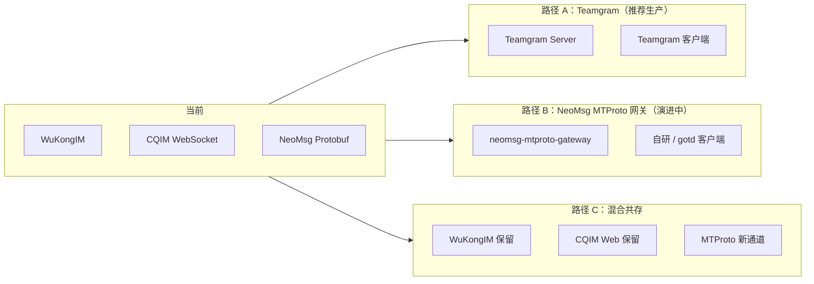

# MTProto 2.0 升级指南

> 将 imimchat / NeoMsg 从 WebSocket + Protobuf 升级为类 Telegram 的 **MTProto 2.0** 协议栈。

---

## 1. 为什么要升级 MTProto？

| 维度 | 当前（CQIM / NeoMsg Protobuf） | MTProto 2.0（Telegram 同款） |
|------|-------------------------------|------------------------------|
| 传输 | WebSocket / 自定义 TCP 帧 | Abridged / Intermediate TCP |
| 加密 | TLS + 应用层 JWT | DH 握手 + AES-IGE 永久 Auth Key |
| 序列化 | Protobuf / JSON | TL Schema（Constructor ID） |
| 客户端 | Web / 自研 App | Teamgram 客户端或自研 MTProto SDK |
| 生态 | 自维护 | 可复用 Telegram API 文档与开源实现 |

**注意：** MTProto 不是「换一下 Docker 镜像」就能让现有 Web 前端直接连上。需要 **MTProto 原生客户端**（Teamgram Android/iOS/Desktop）或基于 `gotd/td` 开发自研客户端。

---

## 2. 三种升级路径



### 路径 A：集成 Teamgram（最快落地完整 MTProto）

- **优点：** 完整 TL API、注册/登录/群/频道/Bot，兼容 Teamgram 客户端
- **缺点：** 独立 MySQL/etcd/Kafka 栈，与 CQIM 用户数据需同步
- **适用：** 需要尽快提供「真·Telegram 体验」的场景

```bash
./scripts/deploy-mtproto.sh teamgram
```

详见 [neomsg/deploy/teamgram/README.md](../neomsg/deploy/teamgram/README.md)

### 路径 B：NeoMsg 自研 MTProto 网关（本 PR 实现）

- **优点：** 与 NeoMsg PostgreSQL/Redis 统一，可渐进扩展 TL 方法
- **缺点：** 当前仅实现握手 + Ping/Pong，业务 API 待扩展
- **适用：** 长期自主可控、与 NeoMsg 架构深度融合

```bash
./scripts/deploy-mtproto.sh neomsg
```

实现位置：

```
neomsg/backend/internal/mtproto/
├── transport/     # Abridged / Intermediate 编解码
├── crypto/          # AES-IGE、RSA、DH、Auth Key
├── handshake/       # req_pq → dh_gen_ok
├── tl/              # TL 基础类型
├── connection.go    # 连接状态机
└── server.go        # TCP :10443 监听

neomsg/backend/cmd/mtproto-gateway/   # 独立进程
```

### 路径 C：混合共存（推荐过渡期）

| 流量 | 通道 | 端口 |
|------|------|------|
| Web 用户 | CQIM `/cqim` WebSocket | 443 |
| 老移动端 | WuKongIM | 5100/5200 |
| 新原生客户端 | MTProto TCP | **10443** |
| REST / Bot | CQIM HTTP API | 443 |

---

## 3. 快速部署 NeoMsg MTProto 网关

```bash
cd neomsg/deploy
cp .env.example .env

# 启动 NeoMsg 全栈 + MTProto 网关
docker compose -f docker-compose.yaml -f docker-compose.mtproto.yaml up -d --build
```

| 服务 | 端口 | 说明 |
|------|------|------|
| `neomsg-mtproto-gateway` | **10443** | MTProto TCP |
| 健康检查 | 10444 | `GET /health` |

环境变量：

| 变量 | 默认 | 说明 |
|------|------|------|
| `MTPROTO_ADDR` | `:10443` | 监听地址 |
| `MTPROTO_HEALTH_ADDR` | `:10444` | HTTP 健康检查 |
| `MTPROTO_RSA_KEY` | `/data/rsa.pem` | RSA 私钥 PEM（首次自动生成） |

---

## 4. Nginx 四层转发（生产）

MTProto 是 **纯 TCP**，需在 Nginx `stream` 块做 L4 代理（不能走 HTTP `location`）：

```nginx
# /etc/nginx/nginx.conf 的 stream {} 块
stream {
    upstream mtproto_backend {
        server 127.0.0.1:10443;
    }

    server {
        listen 10443;
        proxy_pass mtproto_backend;
        proxy_connect_timeout 10s;
        proxy_timeout 300s;
    }
}
```

若需通过域名 + 443 复用（Telegram 常用 443 穿透防火墙），可用 `ssl_preread` 按首包分流 HTTP/HTTPS 与 MTProto，或单独开放 10443。

---

## 5. 协议实现状态（NeoMsg MTProto 网关）

| 模块 | 状态 | 说明 |
|------|------|------|
| Abridged Transport (`0xef`) | ✅ | 长度编码 / 4 字节对齐 |
| Intermediate Transport | ✅ | 4 字节 LE 长度 |
| `req_pq_multi` → `resPQ` | ✅ | RSA 指纹返回 |
| `req_DH_params` → `server_DH_params_ok` | ✅ | DH 参数交换 |
| `set_client_DH_params` → `dh_gen_ok` | ✅ | Auth Key 生成 |
| AES-IGE 加密消息 | ✅ | 基于 `gotd/ige` |
| `ping` / `pong` | ✅ | 心跳 |
| `auth.sendCode` / `auth.signIn` | 🔲 | 待对接 NeoMsg Auth |
| `messages.sendMessage` | 🔲 | 待对接 Message Service |
| Updates 推送 | 🔲 | 待实现 |

---

## 6. 客户端选择

| 客户端 | 协议 | 对接方式 |
|--------|------|----------|
| **Teamgram Android/iOS/Desktop** | MTProto 全量 | 修改 `api_id` / 服务器 IP → 路径 A |
| **NeoMsg iOS（当前）** | Protobuf WebSocket | 需新增 MTProto 模块或换用 gotd |
| **CQIM Web** | HTTP + WS | 不升级 MTProto，继续路径 C |
| **自研客户端** | MTProto | 参考 [gotd/td](https://github.com/gotd/td) |

---

## 7. 数据迁移建议

1. **用户账号：** CQIM `User` → Teamgram `users` 或 NeoMsg `users`（手机号为主键）
2. **消息历史：** 按需批量导入；MTProto 客户端通常从空会话开始也可接受
3. **群组/频道：** Teamgram 有独立 schema，需写迁移脚本
4. **Bot Token：** CQIM Bot API 与 Telegram Bot API 格式兼容，可保留 HTTP 层

---

## 8. 与 WuKongIM / CQIM 的关系

```
┌─────────────────────────────────────────────────────────┐
│                    wed.imim.chat (Nginx)                   │
├─────────────┬──────────────┬──────────────┬─────────────┤
│  / (WuKong) │  /cqim (Web) │  /api        │  :10443 TCP │
│  WebSocket  │  CQIM React  │  REST/Bot    │  MTProto    │
└──────┬──────┴──────┬───────┴──────┬───────┴──────┬──────┘
       │             │              │              │
   WuKongIM      cqim-app       cqim-app      Teamgram /
   TangSeng      SQLite/Mongo                  NeoMsg MTProto
```

**建议节奏：**

1. **Phase 1（本 PR）：** 部署 MTProto 网关 / Teamgram，与现有系统并行
2. **Phase 2：** NeoMsg MTProto 对接 Auth + Message Service
3. **Phase 3：** 发布 Teamgram/自研原生客户端，Web 继续 CQIM
4. **Phase 4（可选）：** 逐步下线 WuKongIM

---

## 9. 参考链接

- [MTProto 2.0 描述](https://core.telegram.org/mtproto/description)
- [MTProto 传输层](https://core.telegram.org/mtproto/mtproto-transports)
- [Teamgram Server](https://github.com/teamgram/teamgram-server)
- [gotd/td（Go MTProto 客户端库）](https://github.com/gotd/td)
- [NeoMsg 架构](./neomsg/docs/ARCHITECTURE.md)
