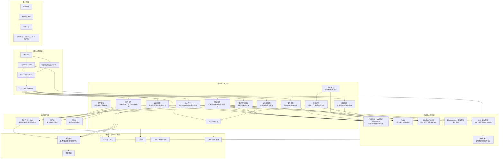

# 类 Telegram 即时通讯项目架构图

> 可视化架构图：[architecture-tg.html](./architecture-tg.html)

## 架构全景图

---

## 架构说明

### 1. 客户端层
覆盖 iOS / Android / Web / Windows / macOS / Linux 桌面端。核心要求：多端同步、设备管理、消息一致性、草稿同步。

### 2. 接入与加速层
保证访问稳定性和安全性：DNSPod 域名解析、EdgeOne/CDN 文件加速、GAAP 全球加速、WAF/Anti-DDoS 防护、CLB/API Gateway 统一入口。

### 3. 核心业务服务层（自研重点）
账号服务、用户资料服务、关系链服务、普通群/超级群服务、频道服务、Bot 平台、文件服务、搜索服务、通知服务、风控服务、审核后台、运营管理后台。超级群、频道、Bot、搜索、风控是类 TG 的关键差异点。

### 4. 腾讯云通信能力层
对接腾讯云 IM/Chat（单聊/群聊/消息）、TRTC（音视频通话）、TPNS（移动端推送）。

### 5. 数据与中间件层
TDSQL-C/MySQL/PostgreSQL（业务数据）、Redis（缓存/限流）、CKafka/TDMQ（异步任务/广播）、Elasticsearch（全文搜索）、COS（文件存储）、数据万象 CI（图片处理）。

### 6. 安全治理和运维层
内容安全、举报处理、人工审核、封禁管理、日志检索、监控告警、APM、操作审计。

---

## 当前项目对照与落地分析

### 已具备的能力（cqim-app + imimchat）

| 架构层级 | 架构图组件 | 当前实现 | 状态 |
|---------|-----------|---------|------|
| 接入层 | CLB/Nginx | nginx/wed.imim.chat.conf（HTTPS/SSL/限流/安全头） | ✅ 生产就绪 |
| 接入层 | CDN | EdgeOne（已连接） | ✅ 已接入 |
| 通信层 | IM 单聊/群聊 | cqim-app/server/private-chat.ts + group-message.ts | ✅ 生产就绪 |
| 通信层 | TRTC 音视频 | cqim-app（TRTC SDK v5）+ register-service/trtc.py | ✅ 已集成 |
| 通信层 | 推送 | APNs + FCM + 个推（apns.ts/fcm.ts/getui.ts） | ✅ 三通道覆盖 |
| 业务层 | 账号/资料 | server/auth.ts + User model | ✅ 完整 |
| 业务层 | 好友关系 | server/friend.ts | ✅ 完整 |
| 业务层 | 群组 | server/group-message.ts（支持万人群） | ✅ 核心功能 |
| 业务层 | 频道服务 | server/channel.ts + ChannelsPage + ChannelDetailPage | ✅ 已实现 |
| 业务层 | 超级群 | 慢速模式 + 权限设置 API（group-message.ts） | ✅ 已实现 |
| 业务层 | Bot 平台 | server/bot-platform.ts（TG Bot API + OneBot 兼容） | ✅ 已实现 |
| 业务层 | 搜索服务 | server/search.ts + GlobalSearchPage | ✅ 已实现 |
| 业务层 | 风控服务 | server/risk-control.ts（敏感词/限流/慢速模式） | ✅ 已实现 |
| 业务层 | 文件服务 | COS + MinIO 双存储 | ✅ 完整 |
| 业务层 | E2EE 加密 | Signal Protocol + MLS | ✅ 已实现 |
| 数据层 | PostgreSQL | 当前用 MongoDB + SQLite，PostgreSQL 在 Go 版设计中 | 🔶 架构设计中 |
| 数据层 | Redis | Redis 7.2（会话/缓存/PubSub） | ✅ 生产就绪 |
| 数据层 | MQ | server/mq.ts（Redis Pub/Sub，可扩展 Kafka） | ✅ 已实现 |
| 数据层 | COS + CI | cos-signer.ts + imageMogr2 实时缩略图 | ✅ 完整 |
| 治理层 | 审核后台 | admin.ts + AdminPage（举报/敏感词/IP 黑名单） | ✅ 已实现 |

### 待扩展能力

| 架构图组件 | 当前状态 | 优先级 |
|-----------|---------|--------|
| Elasticsearch 全文索引 | 预留 ELASTICSEARCH_URL 钩子，当前用 SQLite LIKE | P1 |
| 桌面客户端 | 无原生桌面端 | P2 |
| GAAP 全球加速 | 未配置 | P2 |
| 内容安全（图片/音频 AI 审核） | 仅敏感词文本过滤 | P1 |
| CKafka / TDMQ 生产级 MQ | Redis Pub/Sub 已满足中小规模 | P2 |

---

## 新增服务 API 速查

### Bot 平台（`server/bot-platform.ts`）

| 方法 | 路径 | 说明 |
|------|------|------|
| POST | `/api/bot/create` | 创建 Bot（返回 Token） |
| GET | `/api/bot/list?ownerId=` | 列出用户创建的 Bot |
| GET | `/bot{token}/getMe` | TG 风格：获取 Bot 信息 |
| POST | `/bot{token}/sendMessage` | 发送消息 |
| POST | `/bot{token}/setWebhook` | 设置 Webhook |
| GET | `/bot{token}/getUpdates` | 长轮询获取更新 |

### 搜索服务（`server/search.ts`）

| 方法 | 路径 | 说明 |
|------|------|------|
| GET | `/api/search?q=&scope=all&userId=` | 全局搜索（消息/用户/群/频道/文件） |

### 风控服务（`server/risk-control.ts`）

| 方法 | 路径 | 说明 |
|------|------|------|
| GET | `/api/risk/config` | 获取风控配置 |
| PUT | `/api/risk/config` | 更新风控配置 |
| POST | `/api/risk/check` | 手动检测内容 |

### 超级群设置

| 方法 | 路径 | 说明 |
|------|------|------|
| PUT | `/api/group/settings` | 设置慢速模式、权限（仅群主） |

### 消息队列（`server/mq.ts`）

内部服务，主题包括：`message.sent`、`bot.update`、`audit.report`、`risk.alert`、`search.index`。

---

## 三阶段落地路线

### 第一阶段：基础聊天版 ✅
账号、单聊、普通群、图片/语音/文件消息、离线推送、基础审核、日志监控和管理后台。

### 第二阶段：TG 核心体验 ✅（本次完善）
超级群慢速模式、频道、Bot 平台、消息搜索、风控策略、MQ 异步流转。

### 第三阶段：平台增强版
密聊增强、Bot 开放平台生态、全球加速与多地域容灾、Elasticsearch 全文索引、AI 内容审核。
