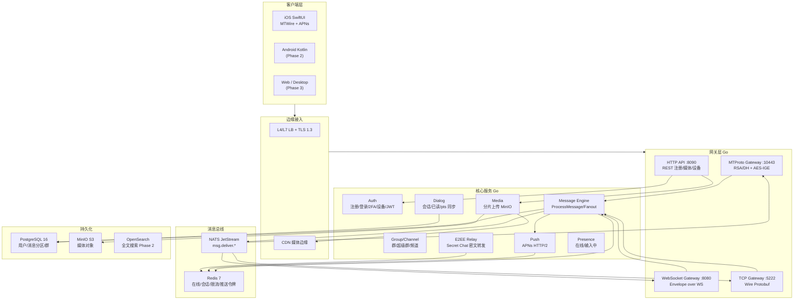
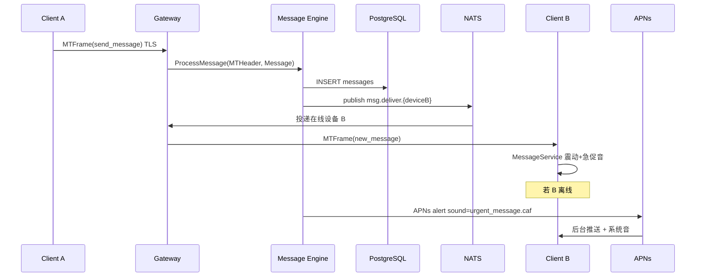

# NeoMsg 完整技术方案

> 类 Telegram 高性能 IM · MTProto-like + Protobuf · 云同步 + Secret Chat E2EE  
> 版本 v1.1 · 2026-06-26

---

## 1. 整体架构图



### 单聊消息时序



---

## 2. 技术选型与理由

| 组件 | 选型 | 理由 |
|------|------|------|
| 后端 | **Go 1.22+** | 百万级长连接、低延迟 fan-out、单二进制部署 |
| iOS | **Swift 5.9 + SwiftUI** | 原生性能、Keychain、UNUserNotification、Taptic Engine |
| 协议 | **MTProto-like 帧头 + Protobuf 3** | 固定头可路由/鉴权；Payload 可演进、跨语言 |
| MTProto 2.0 | 完整握手栈 `internal/mtproto/` | 类 TG 原生客户端、Auth Key 会话 |
| 数据库 | **PostgreSQL 16** | 分区表、JSONB、GIN 全文、强一致 |
| 缓存 | **Redis 7** | 在线集合、设备会话、限流、推送 token 缓存 |
| 队列 | **NATS JetStream** | 轻量、跨网关投递、`msg.deliver.{deviceID}` |
| 媒体 | **MinIO (S3)** | 分片上传、CDN 回源 |
| E2EE | **X3DH + Double Ratchet** | Secret Chat；服务端仅转发密文 |
| 推送 | **APNs HTTP/2 Token Auth** | iOS 后台可达、自定义 `urgent_message.caf` |
| 搜索 | OpenSearch (Phase 2) | 消息/用户全文 |

---

## 3. 项目目录结构

```
neomsg/
├── docs/
│   ├── ARCHITECTURE.md          # 本文档
│   └── MTProto_CLIENT.md
├── proto/neomsg/v1/
│   ├── wire.proto               # Message / WirePacket
│   ├── envelope.proto           # Envelope 统一包装
│   └── messages.proto           # 业务消息类型
├── backend/
│   ├── cmd/
│   │   ├── api/main.go          # REST API :8090
│   │   ├── gateway/main.go      # WS + TCP :8080/:5222
│   │   └── mtproto-gateway/     # MTProto :10443
│   ├── internal/
│   │   ├── auth/                # 注册/登录/JWT/2FA
│   │   ├── message/
│   │   │   ├── engine.go        # ProcessMessage / Fanout
│   │   │   └── service.go
│   │   ├── protocol/
│   │   │   ├── mt_header.go     # 上下文头
│   │   │   ├── mt_frame.go      # 32B 二进制帧头
│   │   │   └── frame.go         # 4B 长度前缀编解码
│   │   ├── mtproto/             # MTProto 2.0 完整栈
│   │   ├── push/apns.go         # APNs 离线推送
│   │   ├── storage/             # 消息持久化
│   │   └── store/
│   │       ├── postgres/
│   │       └── redis/
│   └── migrations/001_init.sql
├── clients/ios/NeoMsg/
│   └── NeoMsg/
│       ├── App/                 # NeoMsgApp + AppCoordinator
│       ├── Core/
│       │   ├── Network/
│       │   │   ├── ConnectionManager.swift
│       │   │   ├── WireFrameCodec.swift
│       │   │   └── APIClient.swift
│       │   ├── Notifications/
│       │   │   ├── NotificationManager.swift
│       │   │   ├── MessageService.swift
│       │   │   └── PushNotificationHandler.swift
│       │   ├── Crypto/            # E2EE Keychain
│       │   └── Storage/           # SyncEngine / MessageStore
│       └── Features/Chats/
└── deploy/
    ├── docker-compose.yaml
    ├── docker-compose.mtproto.yaml
    └── .env.example
```

---

## 4. 数据库核心表结构

完整 DDL：`backend/migrations/001_init.sql`

| 表 | 用途 | 关键字段 |
|----|------|----------|
| `users` | 用户 | `username`, `phone`, `password_hash`, `two_factor_*`, `pts` |
| `devices` | 多设备 | `user_id`, `device_id`, `platform`, `push_token` |
| `auth_sessions` | 登录会话 | `token_hash`, `expires_at` |
| `dialogs` | 会话 | `type` (private/group/supergroup/channel/secret), `last_msg_*` |
| `dialog_members` | 成员/已读 | `last_read_id`, `role`, `is_muted` |
| `messages` | 消息（按月分区） | `dialog_id`, `seq`, `content` BYTEA, `content_text` |
| `groups` / `channels` | 群/频道扩展 | `slow_mode_secs`, `subscriber_count` |
| `media_objects` | 媒体元数据 | `storage_key`, `mime_type`, `size_bytes` |
| `upload_sessions` | 分片上传 | `part_size` 5MB, `parts_received` |
| `e2ee_sessions` / `prekeys` | Secret Chat | X3DH 公钥池 |
| `push_tokens` | APNs/FCM | `token`, `platform`, `device_id` |
| `pts_log` | 增量同步 | `user_id`, `pts`, `event_data` JSONB |

---

## 5. 通信协议定义

### 5.1 帧格式（MTProto-like）

```
┌──────────────┬─────────────────────────────┬──────────────────────┐
│ 4B 大端长度   │ 32B MTHeader                │ Protobuf Payload     │
│ body_len     │ magic+ver+type+ids          │ WirePacket/Envelope  │
└──────────────┴─────────────────────────────┴──────────────────────┘
```

**MTHeader（32 字节，大端）**

| 偏移 | 长度 | 字段 |
|------|------|------|
| 0 | 4 | Magic `0x4E454F4D` ("NEOM") |
| 4 | 1 | Version = 1 |
| 5 | 1 | PayloadType: 1=WirePacket, 2=Envelope |
| 6 | 2 | Flags |
| 8 | 8 | auth_key_id |
| 16 | 8 | session_id |
| 24 | 8 | user_id |

实现：`backend/internal/protocol/mt_frame.go` · iOS `WireFrameCodec.swift`

### 5.2 Protobuf 示例

**wire.proto — 核心消息**

```protobuf
message Message {
  int64 id = 1;
  int64 chat_id = 2;
  int64 from_id = 3;
  string content = 5;
  int32 msg_type = 6;
  int64 seq_id = 8;
  int64 timestamp = 9;
  bool is_secret = 10;
}

message WirePacket {
  oneof payload {
    Message message = 1;
    MessageAck message_ack = 2;
    SyncRequest sync_request = 3;
    SyncResponse sync_response = 4;
  }
}
```

**envelope.proto — 发送消息**

```protobuf
message Envelope {
  string request_id = 1;
  int64 seq = 2;
  int64 pts = 3;
  oneof payload {
    SendMessageRequest send_message = 11;
    NewMessageEvent new_message = 21;
    AckReadRequest ack_read = 12;
    // ...
  }
}

message SendMessageRequest {
  int64 dialog_id = 1;
  MessageType msg_type = 2;
  bytes content = 3;
  string client_msg_id = 4;
}
```

### 5.3 传输层加密

| 层级 | 普通聊天 | Secret Chat |
|------|----------|-------------|
| 传输 | TLS 1.3 + 可选 MTProto Auth Key AES-IGE | 同左 |
| 载荷 | 服务端可读 `content_text` 索引 | `MSG_TYPE_ENCRYPTED` 密文，服务端不解析 |
| 密钥 | 服务端托管 | 客户端 Double Ratchet，仅 prekey 交换经服务器 |

---

## 6. 核心代码框架

### 6.1 后端消息引擎

入口：`backend/internal/message/engine.go`

```go
// ProcessMessage — 鉴权 → 持久化 → 更新 seq → 在线 fan-out → 离线推送
func (e *Engine) ProcessMessage(ctx context.Context, header *protocol.MTHeader, msg *pb.Message) (*pb.MessageAck, error) {
    if err := e.validateSession(header); err != nil { return nil, err }
    // 限流、补全 from_id / id
    saved, _ := e.store.SaveMessage(ctx, msg)
    msg.SeqId = saved.Seq
    e.updateChatSeq(ctx, msg.ChatId, msg.SeqId)
    e.fanoutToOnlineDevices(msg)      // NATS msg.deliver.{deviceID}
    go e.pushToOfflineUsers(ctx, msg)   // APNs
    return &pb.MessageAck{MsgId: msg.Id, SeqId: msg.SeqId, Success: true}, nil
}
```

**Fanout 路由逻辑**

1. `pg.ListDialogMemberIDs(chatID)` 获取会话成员
2. `redis.ListUserDevices(userID)` 获取各成员在线设备
3. 跳过发送方；`protocol.EncodeMessageForDevice` 编码 Wire 帧
4. `nats.Publish("msg.deliver."+deviceID, DeliveryPacket)`
5. 网关订阅对应 subject，写入 WebSocket/TCP/MTProto 连接

### 6.2 iOS 网络层

`ConnectionManager.swift` — WebSocket 长连接、心跳、重连、离线队列  
`WireFrameCodec.swift` — MTHeader 编解码 + 4B 长度前缀

```swift
// 发送：构建 MTHeader + Protobuf，再 encode 为帧
let header = MTHeader(userID: uid, sessionID: sid, payloadType: 2)
let frame = WireFrameCodec.encode(header: header, protobufPayload: envelopeData)
connectionManager.send(frame)
```

### 6.3 iOS NotificationManager（震动 + 急促音）

`Core/Notifications/NotificationManager.swift`

| 反馈 | 实现 |
|------|------|
| 震动 | `UIImpactFeedbackGenerator` heavy → 0.1s → medium |
| 急促音 | 优先 `urgent_message.caf`，否则系统 **1005**（紧急连响两次） |

`MessageService.onNewMessageReceived` — 前台 WebSocket 新消息统一入口  
`PushNotificationHandler` — `UNUserNotificationCenterDelegate` 处理 APNs 前台/后台/点击

```swift
// 前台长连接收到消息
MessageService.shared.onNewMessageReceived(
    IncomingMessagePayload(chatId: dialogID, messageId: id, senderId: sender, preview: text)
)

// 前台 APNs
func userNotificationCenter(_:willPresent:withCompletionHandler:) {
    MessageService.shared.onNewMessageReceived(...)
    completionHandler([.banner, .sound, .badge])
}
```

---

## 7. 部署方案（Docker Compose）

```bash
cd neomsg/deploy
cp .env.example .env
docker compose up -d --build
# MTProto 网关（可选）
docker compose -f docker-compose.yaml -f docker-compose.mtproto.yaml up -d --build
```

| 服务 | 端口 | 说明 |
|------|------|------|
| neomsg-gateway | 8080 / 5222 | WebSocket + Protobuf TCP |
| neomsg-api | 8090 | REST |
| mtproto-gateway | 10443 | MTProto 2.0 |
| postgres | 5432 | 自动执行 `001_init.sql` |
| redis | 6379 | |
| nats | 4222 | JetStream |
| minio | 9000 | 媒体 |

---

## 8. APNs 推送 + 后台震动/提示音

### 8.1 服务端配置

`.env`：

```env
APNS_AUTH_KEY_PATH=/certs/AuthKey_XXX.p8
APNS_KEY_ID=URP8X87T38
APNS_TEAM_ID=4U332QFN6D
APNS_BUNDLE_ID=com.neomsg.app
APNS_SANDBOX=1
```

实现：`backend/internal/push/apns.go`

```json
{
  "aps": {
    "alert": { "title": "NeoMsg", "body": "你好" },
    "sound": "urgent_message.caf",
    "badge": 1,
    "content-available": 1
  },
  "dialog_id": 12345,
  "preview": "你好"
}
```

- **`sound: urgent_message.caf`** — 需将音频加入 iOS App Bundle（见下）
- **`content-available: 1`** — 静默唤醒，配合 `handleRemoteNotification` 拉取增量

### 8.2 iOS 客户端配置

1. **Capabilities**：Push Notifications、Background Modes → Remote notifications  
2. **Info.plist**：`NSUserNotificationsUsageDescription`  
3. **音频资源**：将 `urgent_message.caf`（0.1–0.3s 短促音）拖入 App target  
4. **AppDelegate**：`NeoMsgApp.swift` 已集成 `PushNotificationHandler`

### 8.3 前台 vs 后台行为

| 场景 | 震动 | 提示音 | 实现 |
|------|------|--------|------|
| App 前台 + WebSocket 消息 | UIImpactFeedbackGenerator | custom caf / 1005 | `MessageService` |
| App 前台 + APNs | 同上 + 系统 banner | aps.sound + 本地补充 | `willPresent` |
| App 后台/锁屏 | 系统处理 | **aps.sound** 播放 bundle 内 caf | APNs payload |
| 用户点击通知 | — | — | 跳转 `dialog_id` 对应会话 |

> 后台无法直接调用 `UIImpactFeedbackGenerator`；依赖 APNs `sound` 字段 + 用户系统触感设置。前台则由 `NotificationManager` 主动触发 Taptic + `AudioServicesPlaySystemSound`。

---

## 9. 后续迭代路线图

| 阶段 | 周期 | 目标 |
|------|------|------|
| **Phase 1 MVP** | ~10 周 | 单聊/群聊、媒体分片、pts 同步、iOS Alpha、APNs、Secret Chat 基础 |
| **Phase 2 TG Core** | ~12 周 | 频道、Bot API、超级群慢速模式、Android、OpenSearch |
| **Phase 3 Scale** | ~16 周 | 音视频 SFU、全球多区域、桌面端、风控/审计 |
| **Phase 4 Enterprise** | 持续 | 联邦互通、合规归档、私有化交付 |

### Phase 1 任务拆解

- [ ] SwiftProtobuf 接入 iOS 解码 Envelope
- [ ] 完整 APNs JWT（apns2）替换 placeholder
- [ ] 媒体分片上传 API + iOS 进度 UI
- [ ] Secret Chat Double Ratchet 完整实现
- [ ] 压测：单网关 10万连接、1万 QPS 消息

---

*仓库代码入口：`neomsg/README.md` · MTProto 升级：`docs/MTPROTO_UPGRADE.md`*
