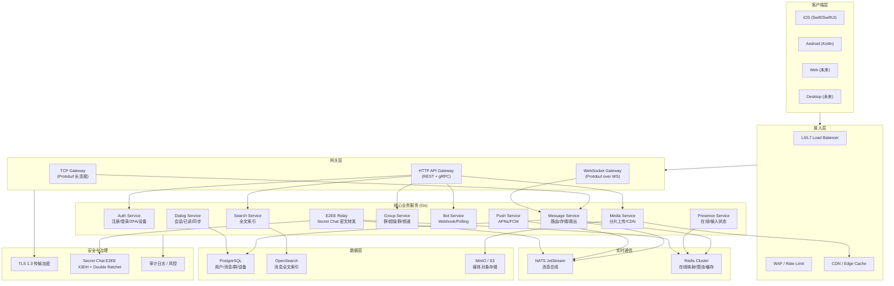
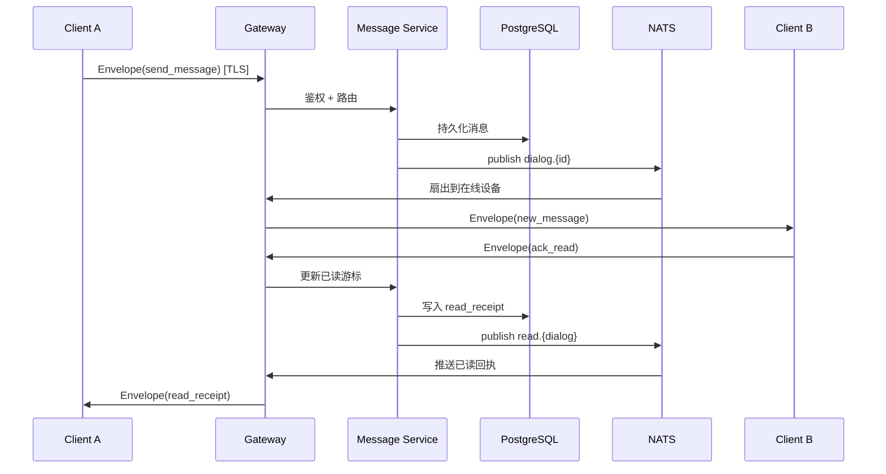

# NeoMsg 技术方案

> 类 Telegram 高性能 IM 系统完整设计文档  
> 版本：v1.0 · 2026-06-26

---

## 1. 整体架构图



### 消息流转（单聊）



---

## 2. 技术选型与理由

| 组件 | 选型 | 理由 |
|------|------|------|
| **后端语言** | **Go 1.22+** | 高并发 goroutine 适合百万连接网关；编译快、部署简单。 |
| **iOS 客户端** | **Swift 5.9 + SwiftUI** | 原生性能、Keychain 安全存储、Background Tasks。 |
| **Android** | Kotlin (Phase 2) | 与 iOS 共享 Protobuf 协议。 |
| **传输协议** | **MTProto 2.0 + Protobuf 3** | MTProto 服务原生客户端（类 TG）；Protobuf 服务 Web/过渡客户端。 |
| **长连接** | MTProto TCP + WebSocket + Protobuf TCP | MTProto `:10443`；WS 穿透性好；Protobuf TCP 移动端过渡。 |
| **关系数据库** | **PostgreSQL 16** | ACID、JSONB、分区表支持海量消息。 |
| **缓存** | **Redis 7** | 在线状态、会话映射、限流。 |
| **消息队列** | **NATS JetStream** | 轻量持久化、至少一次投递。 |
| **对象存储** | **MinIO (S3)** | 媒体分片上传、CDN 回源。 |
| **E2EE** | **X3DH + Double Ratchet** | Signal Protocol 同款；服务端只转发密文。 |

---

## 3. 项目目录结构

见仓库根目录 `neomsg/backend/` 与 `neomsg/clients/ios/`。

---

## 4. 数据库表结构

见 `backend/migrations/001_init.sql`。

---

## 5. 通信协议

### 5.1 Wire 协议（长连接主载荷）

定义见 `proto/neomsg/v1/wire.proto`。

**消息引擎**（`internal/message/engine.go`）处理链路：

1. `validateSession` — 校验 MTHeader / AuthKey
2. `storage.MessageStore.SaveMessage` — 持久化
3. `updateChatSeq` — Redis 更新 `chat:seq:{id}`
4. `fanoutToOnlineDevices` — NATS `msg.deliver.{deviceID}`
5. `pushToOfflineUsers` — APNs/FCM 离线推送
6. 返回 `MessageAck`

### 5.2 Envelope（扩展能力）

见 `proto/neomsg/v1/envelope.proto` 与 `messages.proto`（认证、媒体上传、已读回执等）。

### 5.3 MTProto 2.0（类 Telegram 原生客户端）

实现目录：`backend/internal/mtproto/`

| 层 | 说明 |
|----|------|
| Transport | Abridged (`0xef`) / Intermediate |
| Crypto | RSA + DH → Auth Key；AES-IGE 消息加密 |
| Handshake | `req_pq_multi` → `dh_gen_ok` |
| TL | Constructor ID 序列化 |

部署：`docker compose -f docker-compose.yaml -f docker-compose.mtproto.yaml up -d`

完整升级指南见仓库根目录 [docs/MTPROTO_UPGRADE.md](../../docs/MTPROTO_UPGRADE.md)。

---

## 6. 核心代码框架

见 `backend/internal/` 与 `clients/ios/NeoMsg/NeoMsg/Core/`。

---

## 7. 部署

```bash
cd neomsg/deploy && docker compose up -d
```

---

## 8. 迭代路线图

| 阶段 | 目标 | 周期 |
|------|------|------|
| Phase 1 MVP | 单聊/群聊/媒体/推送/iOS Alpha | ~10 周 |
| Phase 2 TG Core | 频道/Bot/搜索/Android/超级群 | ~12 周 |
| Phase 3 Advanced | E2EE/音视频/全球部署/桌面 | ~16 周 |
